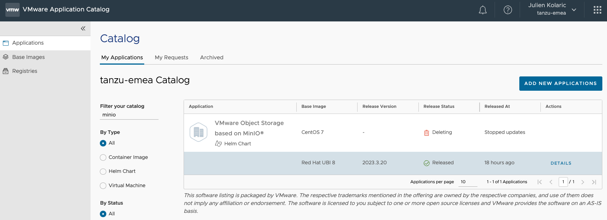

# Table of Contents
1. [Prerequisites](#prerequisites)
2. [Install Velero command line](#velero-cli)
3. [Minio Installation](#minio-installation)
4. [My application](#my-application)
5. [Velero installation](#velero-installation)
6. [Uninstall Velero](#uninstalling-velero-on-a-kubernetes-cluster)
7. [Backup my application](#backup-my-application)
8. [Restore my application](#restore-my-application)

 
# Velero on a TKG infrastructure test
## prerequisites
- install the velero command line on your terminal
- Kubernetes clusters - in my case it was TKGs clusters 
- Minio
- S3 bucket created and configured with a dedicated user

## velero-cli
Install Velero command line

Download the supported version of the velero binary from the VMware customer connect portal

🔗 - [Velero 1.9.5](https://customerconnect.vmware.com/downloads/details?downloadGroup=VELERO-195&productId=1408)

Select the version you need depending on your environment.
On my side, I'm using MAC to interact with my clusters, so I will download the Velero 1.9.5 for Mac version.
To download it, you must login and accept the VMware General Terms 

Open a command line and change directory to the velero CLI download
```console
➜  ~ cd Downloads
```

Unzip the download file and check for the Velero binary
```
➜  Downloads gunzip velero-mac-v1.9.5+vmware.1.gz
➜  Downloads ls -lrt velero-mac-v1.9.5+vmware.1
-rw-r--r--  1 jkolaric  staff  70319248 22 mar 14:57 velero-mac-v1.9.5+vmware.1
```

Grant execute permissions to the Velero CLI.
```
➜  Downloads chmod +x velero-mac-v1.9.5+vmware.1
```

Make the Velero CLI globally available by moving it to the system path
```
➜  Downloads sudo cp velero-mac-v1.9.5+vmware.1 /usr/local/bin/velero
Password:
```

Verify the installation.
```
➜  Downloads velero version
Client:
	Version: v1.9.5_vmware.1
	Git commit: 2b5281f38aad2527f95b55644b20fb169a6702a7-dirty
Server:
	Version: v1.6.3_vmware.1
```

Velero is now installed and ready to interact.

```console
➜  ~ velero --help
Velero is a tool for managing disaster recovery, specifically for Kubernetes
cluster resources. It provides a simple, configurable, and operationally robust
way to back up your application state and associated data.

If you're familiar with kubectl, Velero supports a similar model, allowing you to
execute commands such as 'velero get backup' and 'velero create schedule'. The same
operations can also be performed as 'velero backup get' and 'velero schedule create'.

Usage:
  velero [command]

Available Commands:
  backup            Work with backups
  backup-location   Work with backup storage locations
  bug               Report a Velero bug
  client            Velero client related commands
  completion        Generate completion script
  create            Create velero resources
  delete            Delete velero resources
  describe          Describe velero resources
  get               Get velero resources
  help              Help about any command
  install           Install Velero
  plugin            Work with plugins
  restic            Work with restic
  restore           Work with restores
  schedule          Work with schedules
  snapshot-location Work with snapshot locations
  uninstall         Uninstall Velero
  version           Print the velero version and associated image

Flags:
      --add_dir_header                   If true, adds the file directory to the header
      --alsologtostderr                  log to standard error as well as files
      --colorized optionalBool           Show colored output in TTY. Overrides 'colorized' value from $HOME/.config/velero/config.json if present. Enabled by default
      --features stringArray             Comma-separated list of features to enable for this Velero process. Combines with values from $HOME/.config/velero/config.json if present
  -h, --help                             help for velero
      --kubeconfig string                Path to the kubeconfig file to use to talk to the Kubernetes apiserver. If unset, try the environment variable KUBECONFIG, as well as in-cluster configuration
      --kubecontext string               The context to use to talk to the Kubernetes apiserver. If unset defaults to whatever your current-context is (kubectl config current-context)
      --log_backtrace_at traceLocation   when logging hits line file:N, emit a stack trace (default :0)
      --log_dir string                   If non-empty, write log files in this directory
      --log_file string                  If non-empty, use this log file
      --log_file_max_size uint           Defines the maximum size a log file can grow to. Unit is megabytes. If the value is 0, the maximum file size is unlimited. (default 1800)
      --logtostderr                      log to standard error instead of files (default true)
  -n, --namespace string                 The namespace in which Velero should operate (default "velero")
      --skip_headers                     If true, avoid header prefixes in the log messages
      --skip_log_headers                 If true, avoid headers when opening log files
      --stderrthreshold severity         logs at or above this threshold go to stderr (default 2)
  -v, --v Level                          number for the log level verbosity
      --vmodule moduleSpec               comma-separated list of pattern=N settings for file-filtered logging

Use "velero [command] --help" for more information about a command.
```

## Minio-installation 
### VMware Application Catalog minio artefact
To install minio, I will rely on VMware Application Catalog to deliver the helm chart and I will use the helm chart to install minio on a dedicated Tanzu kubernetes Grid cluster



The minio helm chart I decided to use is based on UBI 8 and will be available in my project registry at  https://registry.cloud-garage.net/vac-library/charts/redhatubi-8/minio


### Install minio on a Kubernetes cluster 

Here I want to deploy a minio service on my kubernetes cluster named "mycluster"

```console
➜  ~ helm install minio oci://registry.cloud-garage.net/vac-library/charts/redhatubi-8/minio --set global.storageClass=tanzu-sp --set service.type=LoadBalancer --set auth.rootPassword='minio12345!' --set auth.rootUser='admin' --set persistence.size=50Gi --namespace minio --create-namespace
Pulled: registry.cloud-garage.net/vac-library/charts/redhatubi-8/minio:12.2.0
Digest: sha256:ea887f891463f9cef00da2956f7a7880d11aa692ecbd916fd6cabe06d9f86acb
NAME: minio
LAST DEPLOYED: Wed Mar 22 15:13:05 2023
NAMESPACE: minio
STATUS: deployed
REVISION: 1
TEST SUITE: None
NOTES:
CHART NAME: minio
CHART VERSION: 12.2.0
APP VERSION: 2023.3.20

** Please be patient while the chart is being deployed **

MinIO&reg; can be accessed via port  on the following DNS name from within your cluster:

   minio.minio.svc.cluster.local

To get your credentials run:

   export ROOT_USER=$(kubectl get secret --namespace minio minio -o jsonpath="{.data.root-user}" | base64 -d)
   export ROOT_PASSWORD=$(kubectl get secret --namespace minio minio -o jsonpath="{.data.root-password}" | base64 -d)

To connect to your MinIO&reg; server using a client:

- Run a MinIO&reg; Client pod and append the desired command (e.g. 'admin info'):

   kubectl run --namespace minio minio-client \
     --rm --tty -i --restart='Never' \
     --env MINIO_SERVER_ROOT_USER=$ROOT_USER \
     --env MINIO_SERVER_ROOT_PASSWORD=$ROOT_PASSWORD \
     --env MINIO_SERVER_HOST=minio \
     --image registry.cloud-garage.net/vac-library/containers/redhatubi-8/minio-client:2023.3.20-redhatubi-8-r0 -- admin info minio

To access the MinIO&reg; web UI:

- Get the MinIO&reg; URL:

   NOTE: It may take a few minutes for the LoadBalancer IP to be available.
         Watch the status with: 'kubectl get svc --namespace minio -w minio'
   export SERVICE_IP=$(kubectl get svc --namespace minio minio --template "{{ range (index .status.loadBalancer.ingress 0) }}{{ . }}{{ end }}")
   echo "MinIO&reg; web URL: http://$SERVICE_IP:9001/minio"
```

After few seconds, the minio application is deployed and accessible through the external IP provided by our Loadbalancer.

```console
➜  ~ kubectl get all,pvc -n minio
NAME                         READY   STATUS    RESTARTS   AGE
pod/minio-69b4699cbb-982hv   1/1     Running   0          57s

NAME            TYPE           CLUSTER-IP    EXTERNAL-IP   PORT(S)                         AGE
service/minio   LoadBalancer   10.99.44.60   10.16.3.13    9000:31169/TCP,9001:31432/TCP   58s

NAME                    READY   UP-TO-DATE   AVAILABLE   AGE
deployment.apps/minio   1/1     1            1           58s

NAME                               DESIRED   CURRENT   READY   AGE
replicaset.apps/minio-69b4699cbb   1         1         1       58s

NAME                          STATUS   VOLUME                                     CAPACITY   ACCESS MODES   STORAGECLASS   AGE
persistentvolumeclaim/minio   Bound    pvc-11843a70-ff8d-485a-aca2-639eeacc69ba   50Gi       RWO            tanzu-sp       60s
```

By connecting to the URL provided, you will see minio is accessible.
Log into it and let's create a bucket and a user

### login into minio


### Create a S3 bucket 
Now we are logged into minio, let's create a bucket by clicking on "Create a bucket"


Let's create a "bucket-backup" S3 bucket to store our future backup made by velero
Let all default value and click on "Create Bucket"


Now the bucket is created, let's create a user allowed to access this bucket.


### Create a user to access the bucket

To create a user to access the S3 bucket previously created, click on "Identity > Users" and "Create User"
Fill with appropriate value and select "readwrite" policy.
Then click on Save

FYI, on my side I configured my user with the following information :
- User : bucket-1-user
- password : password


Now, the user "bucket-1-user" is granted "readwrite" access to the minio bucket.

Well, that's it ... Minio is configured and ready to be used to backup kubernetes clusters / kubernetes applications.

## my application

I decided to use an application called guetbook.

To deploy the application, follow the following steps : 
```console
➜  ~ kubectl create ns guestbook
namespace/guestbook created

➜  ~ kubectl apply -f guestbook/guestbook-app.yaml -n guestbook
persistentvolumeclaim/redis-master-claim created
persistentvolumeclaim/redis-slave-claim created
service/redis-master created
deployment.apps/redis-master created
service/redis-slave created
deployment.apps/redis-slave created
service/frontend created
deployment.apps/frontend created
```

You can check all resources deployed thanks to the "guetbook/guestbook-app.yaml" file 

```console
➜  ~ kubectl get all,pvc -n guestbook
NAME                                READY   STATUS    RESTARTS   AGE
pod/frontend-6c6d6dfd4d-46rzj       1/1     Running   0          10m
pod/frontend-6c6d6dfd4d-4wbmx       1/1     Running   0          10m
pod/frontend-6c6d6dfd4d-qr472       0/1     Pending   0          10m
pod/redis-master-7bccc485fc-sj94q   1/1     Running   0          10m
pod/redis-slave-6478c45567-vn7bm    0/1     Pending   0          10m

NAME                   TYPE           CLUSTER-IP     EXTERNAL-IP   PORT(S)        AGE
service/frontend       LoadBalancer   10.102.97.10   10.16.3.16    80:30022/TCP   10m
service/redis-master   ClusterIP      10.99.61.252   <none>        6379/TCP       10m
service/redis-slave    ClusterIP      10.96.45.33    <none>        6379/TCP       10m

NAME                           READY   UP-TO-DATE   AVAILABLE   AGE
deployment.apps/frontend       2/3     3            2           10m
deployment.apps/redis-master   1/1     1            1           10m
deployment.apps/redis-slave    0/1     1            0           10m

NAME                                      DESIRED   CURRENT   READY   AGE
replicaset.apps/frontend-6c6d6dfd4d       3         3         2       10m
replicaset.apps/redis-master-7bccc485fc   1         1         1       10m
replicaset.apps/redis-slave-6478c45567    1         1         0       10m

NAME                                       STATUS   VOLUME                                     CAPACITY   ACCESS MODES   STORAGECLASS   AGE
persistentvolumeclaim/redis-master-claim   Bound    pvc-f7e44a80-ada7-4885-a19b-f9d0a54dc8b0   2Gi        RWO            tanzu-sp       10m
persistentvolumeclaim/redis-slave-claim    Bound    pvc-03fbb04a-371b-4650-816c-d28f6dd385ff   2Gi        RWO            tanzu-sp       10m
```

I can now access the application thanks to the external IP I have as a service on the :80 port (http)


Let's now enter some values into the application to test it 

>IMPORTANT:  Because Redis RDB asynchronously saves snapshots of the dataset to disk in intervals, based on number of write operations, wait a minimum of 300 sec (5 min) before proceeding with the next step. Defaults: after 900 sec (15 min) if at least 1 key changed; after 300 sec (5 min) if at least 10 keys changed; after 60 sec if at least 10000 keys changed

So let's enter at least 10 entries in the guestbook application. To verify the persistence in Redis, you can switch to a new web browser (private/incognito) to the same URL


## Velero installation
### Create credential file 

```console
➜  ~ cat credentials-velero
[default]
aws_access_key_id = bucket-1-user
aws_secret_access_key = password
```

## install velero on the kubernetes cluster 
```console
➜  ~ velero install --provider aws --plugins velero/velero-plugin-for-aws:v1.5.4 --bucket bucket-backup --secret-file ./credentials-velero --use-volume-snapshots=false --use-restic --backup-location-config region=minio,s3ForcePathStyle="true",s3Url=http://10.16.3.13:9000
CustomResourceDefinition/backups.velero.io: attempting to create resource
CustomResourceDefinition/backups.velero.io: attempting to create resource client
CustomResourceDefinition/backups.velero.io: created
CustomResourceDefinition/backupstoragelocations.velero.io: attempting to create resource
CustomResourceDefinition/backupstoragelocations.velero.io: attempting to create resource client
CustomResourceDefinition/backupstoragelocations.velero.io: created
CustomResourceDefinition/deletebackuprequests.velero.io: attempting to create resource
CustomResourceDefinition/deletebackuprequests.velero.io: attempting to create resource client
CustomResourceDefinition/deletebackuprequests.velero.io: created
CustomResourceDefinition/downloadrequests.velero.io: attempting to create resource
CustomResourceDefinition/downloadrequests.velero.io: attempting to create resource client
CustomResourceDefinition/downloadrequests.velero.io: created
CustomResourceDefinition/podvolumebackups.velero.io: attempting to create resource
CustomResourceDefinition/podvolumebackups.velero.io: attempting to create resource client
CustomResourceDefinition/podvolumebackups.velero.io: created
CustomResourceDefinition/podvolumerestores.velero.io: attempting to create resource
CustomResourceDefinition/podvolumerestores.velero.io: attempting to create resource client
CustomResourceDefinition/podvolumerestores.velero.io: created
CustomResourceDefinition/resticrepositories.velero.io: attempting to create resource
CustomResourceDefinition/resticrepositories.velero.io: attempting to create resource client
CustomResourceDefinition/resticrepositories.velero.io: created
CustomResourceDefinition/restores.velero.io: attempting to create resource
CustomResourceDefinition/restores.velero.io: attempting to create resource client
CustomResourceDefinition/restores.velero.io: created
CustomResourceDefinition/schedules.velero.io: attempting to create resource
CustomResourceDefinition/schedules.velero.io: attempting to create resource client
CustomResourceDefinition/schedules.velero.io: created
CustomResourceDefinition/serverstatusrequests.velero.io: attempting to create resource
CustomResourceDefinition/serverstatusrequests.velero.io: attempting to create resource client
CustomResourceDefinition/serverstatusrequests.velero.io: created
CustomResourceDefinition/volumesnapshotlocations.velero.io: attempting to create resource
CustomResourceDefinition/volumesnapshotlocations.velero.io: attempting to create resource client
CustomResourceDefinition/volumesnapshotlocations.velero.io: created
Waiting for resources to be ready in cluster...
Namespace/velero: attempting to create resource
Namespace/velero: attempting to create resource client
Namespace/velero: created
ClusterRoleBinding/velero: attempting to create resource
ClusterRoleBinding/velero: attempting to create resource client
ClusterRoleBinding/velero: created
ServiceAccount/velero: attempting to create resource
ServiceAccount/velero: attempting to create resource client
ServiceAccount/velero: created
Secret/cloud-credentials: attempting to create resource
Secret/cloud-credentials: attempting to create resource client
Secret/cloud-credentials: created
BackupStorageLocation/default: attempting to create resource
BackupStorageLocation/default: attempting to create resource client
BackupStorageLocation/default: created
Deployment/velero: attempting to create resource
Deployment/velero: attempting to create resource client
Deployment/velero: created
DaemonSet/restic: attempting to create resource
DaemonSet/restic: attempting to create resource client
DaemonSet/restic: created
Velero is installed! ⛵ Use 'kubectl logs deployment/velero -n velero' to view the status.
```
### Verifications
Check that pods are running and you can read the backup-location
```console
➜  ~ kubectl get pods -n velero
NAME                      READY   STATUS    RESTARTS        AGE
restic-27sjj              1/1     Running   2 (2m11s ago)   3m16s
restic-8fknt              1/1     Running   0               99s
velero-5bf4f474c6-lhptk   1/1     Running   0               18m
```

Verify the backup location is configured and available.
```console
➜  ~ velero backup-location get
NAME      PROVIDER   BUCKET/PREFIX   PHASE       LAST VALIDATED                  ACCESS MODE   DEFAULT
default   aws        bucket-backup   Available   2023-03-22 16:39:35 +0100 CET   ReadWrite     true
```
Sounds great ... 

Let's perform a backup in the default location seen previously

## backup my application
```console
➜  VELERO velero backup create guestbook-backup --include-namespaces guestbook --storage-location default
Backup request "guestbook-backup" submitted successfully.
Run `velero backup describe guestbook-backup` or `velero backup logs guestbook-backup` for more details.
```

### Verify my backup

```console
➜  ~ velero backup get
NAME               STATUS      ERRORS   WARNINGS   CREATED                         EXPIRES   STORAGE LOCATION   SELECTOR
guestbook-backup   Completed   0        0          2023-03-22 16:57:13 +0100 CET   29d       default            <none>
```

## Restore my application

```console
➜  ~ kubectl delete ns guestbook
namespace "guestbook" deleted
```
... Oups ...

Now, let's assume the developpers deleted their namespace or they broke the application by deleting a resource ... they contacted you to restore the application

The application is no longer accessible ... 

First step is to verify a backup exist for this namespace 
```console
➜  ~ velero backup describe guestbook-backup --details
Name:         guestbook-backup
Namespace:    velero
Labels:       velero.io/storage-location=default
Annotations:  velero.io/source-cluster-k8s-gitversion=v1.22.9+vmware.1
              velero.io/source-cluster-k8s-major-version=1
              velero.io/source-cluster-k8s-minor-version=22

Phase:  Completed

Errors:    0
Warnings:  0

Namespaces:
  Included:  guestbook
  Excluded:  <none>

Resources:
  Included:        *
  Excluded:        <none>
  Cluster-scoped:  auto

Label selector:  <none>

Storage Location:  default

Velero-Native Snapshot PVs:  auto

TTL:  720h0m0s

Hooks:  <none>

Backup Format Version:  1.1.0

Started:    2023-03-22 16:57:13 +0100 CET
Completed:  2023-03-22 16:57:40 +0100 CET

Expiration:  2023-04-21 17:57:13 +0200 CEST

Total items to be backed up:  163
Items backed up:              163

Resource List:
  apps/v1/Deployment:
    - guestbook/frontend
    - guestbook/redis-master
    - guestbook/redis-slave
  apps/v1/ReplicaSet:
    - guestbook/frontend-6c6d6dfd4d
    - guestbook/redis-master-7bccc485fc
    - guestbook/redis-slave-6478c45567
  data.packaging.carvel.dev/v1alpha1/Package:
    - guestbook/cert-manager.tanzu.vmware.com.1.1.0+vmware.1-tkg.2
    - guestbook/cert-manager.tanzu.vmware.com.1.1.0+vmware.2-tkg.1
    - guestbook/cert-manager.tanzu.vmware.com.1.10.1+vmware.1-tkg.2
    - guestbook/cert-manager.tanzu.vmware.com.1.5.3+vmware.2-tkg.1
    - guestbook/cert-manager.tanzu.vmware.com.1.5.3+vmware.4-tkg.1
    - guestbook/cert-manager.tanzu.vmware.com.1.5.3+vmware.7-tkg.2
    - guestbook/cert-manager.tanzu.vmware.com.1.7.2+vmware.1-tkg.1
    - guestbook/cert-manager.tanzu.vmware.com.1.7.2+vmware.3-tkg.2
    - guestbook/contour.tanzu.vmware.com.1.22.3+vmware.1-tkg.1
    - guestbook/external-dns.tanzu.vmware.com.0.10.0+vmware.1-tkg.1
    - guestbook/external-dns.tanzu.vmware.com.0.10.0+vmware.1-tkg.2
    - guestbook/external-dns.tanzu.vmware.com.0.10.0+vmware.1-tkg.4
    - guestbook/external-dns.tanzu.vmware.com.0.11.0+vmware.1-tkg.2
    - guestbook/external-dns.tanzu.vmware.com.0.11.0+vmware.1-tkg.4
    - guestbook/external-dns.tanzu.vmware.com.0.12.2+vmware.4-tkg.2
    - guestbook/external-dns.tanzu.vmware.com.0.8.0+vmware.1-tkg.1
    - guestbook/fluent-bit.tanzu.vmware.com.1.7.5+vmware.1-tkg.1
    - guestbook/fluent-bit.tanzu.vmware.com.1.7.5+vmware.2-tkg.1
    - guestbook/fluent-bit.tanzu.vmware.com.1.8.15+vmware.1-tkg.1
    - guestbook/fluent-bit.tanzu.vmware.com.1.9.5+vmware.1-tkg.1
    - guestbook/fluxcd-helm-controller.tanzu.vmware.com.0.21.0+vmware.1-tkg.1
    - guestbook/fluxcd-helm-controller.tanzu.vmware.com.0.21.0+vmware.1-tkg.2
    - guestbook/fluxcd-helm-controller.tanzu.vmware.com.0.28.1+vmware.1-tkg.1
    - guestbook/fluxcd-kustomize-controller.tanzu.vmware.com.0.24.4+vmware.1-tkg.1
    - guestbook/fluxcd-kustomize-controller.tanzu.vmware.com.0.24.4+vmware.1-tkg.2
    - guestbook/fluxcd-kustomize-controller.tanzu.vmware.com.0.32.0+vmware.1-tkg.1
    - guestbook/fluxcd-source-controller.tanzu.vmware.com.0.24.4+vmware.1-tkg.1
    - guestbook/fluxcd-source-controller.tanzu.vmware.com.0.24.4+vmware.1-tkg.2
    - guestbook/fluxcd-source-controller.tanzu.vmware.com.0.24.4+vmware.1-tkg.3
    - guestbook/fluxcd-source-controller.tanzu.vmware.com.0.24.4+vmware.1-tkg.4
    - guestbook/fluxcd-source-controller.tanzu.vmware.com.0.24.4+vmware.1-tkg.5
    - guestbook/fluxcd-source-controller.tanzu.vmware.com.0.33.0+vmware.1-tkg.1
    - guestbook/grafana.tanzu.vmware.com.7.5.16+vmware.1-tkg.1
    - guestbook/grafana.tanzu.vmware.com.7.5.17+vmware.1-tkg.1
    - guestbook/grafana.tanzu.vmware.com.7.5.7+vmware.1-tkg.1
    - guestbook/grafana.tanzu.vmware.com.7.5.7+vmware.2-tkg.1
    - guestbook/harbor.tanzu.vmware.com.2.2.3+vmware.1-tkg.1
    - guestbook/harbor.tanzu.vmware.com.2.2.3+vmware.1-tkg.2
    - guestbook/harbor.tanzu.vmware.com.2.3.3+vmware.1-tkg.1
    - guestbook/harbor.tanzu.vmware.com.2.5.3+vmware.1-tkg.1
    - guestbook/harbor.tanzu.vmware.com.2.6.3+vmware.1-tkg.1
    - guestbook/multus-cni.tanzu.vmware.com.3.7.1+vmware.1-tkg.1
    - guestbook/multus-cni.tanzu.vmware.com.3.7.1+vmware.2-tkg.1
    - guestbook/multus-cni.tanzu.vmware.com.3.7.1+vmware.2-tkg.2
    - guestbook/multus-cni.tanzu.vmware.com.3.8.0+vmware.1-tkg.1
    - guestbook/multus-cni.tanzu.vmware.com.3.8.0+vmware.2-tkg.2
    - guestbook/prometheus.tanzu.vmware.com.2.27.0+vmware.1-tkg.1
    - guestbook/prometheus.tanzu.vmware.com.2.27.0+vmware.2-tkg.1
    - guestbook/prometheus.tanzu.vmware.com.2.36.2+vmware.1-tkg.1
    - guestbook/prometheus.tanzu.vmware.com.2.37.0+vmware.1-tkg.1
    - guestbook/prometheus.tanzu.vmware.com.2.37.0+vmware.2-tkg.1
    - guestbook/whereabouts.tanzu.vmware.com.0.5.1+vmware.2-tkg.1
    - guestbook/whereabouts.tanzu.vmware.com.0.5.4+vmware.1-tkg.1
  data.packaging.carvel.dev/v1alpha1/PackageMetadata:
    - guestbook/cert-manager.tanzu.vmware.com
    - guestbook/contour.tanzu.vmware.com
    - guestbook/external-dns.tanzu.vmware.com
    - guestbook/fluent-bit.tanzu.vmware.com
    - guestbook/fluxcd-helm-controller.tanzu.vmware.com
    - guestbook/fluxcd-kustomize-controller.tanzu.vmware.com
    - guestbook/fluxcd-source-controller.tanzu.vmware.com
    - guestbook/grafana.tanzu.vmware.com
    - guestbook/harbor.tanzu.vmware.com
    - guestbook/multus-cni.tanzu.vmware.com
    - guestbook/prometheus.tanzu.vmware.com
    - guestbook/whereabouts.tanzu.vmware.com
  discovery.k8s.io/v1/EndpointSlice:
    - guestbook/frontend-895xq
    - guestbook/redis-master-jnkhs
    - guestbook/redis-slave-97ch7
  v1/ConfigMap:
    - guestbook/kube-root-ca.crt
  v1/Endpoints:
    - guestbook/frontend
    - guestbook/redis-master
    - guestbook/redis-slave
  v1/Event:
    - guestbook/frontend-6c6d6dfd4d-ctxpt.174ec87d09f47bf9
    - guestbook/frontend-6c6d6dfd4d-ctxpt.174ec87d411aff73
    - guestbook/frontend-6c6d6dfd4d-ctxpt.174ec87d462b3055
    - guestbook/frontend-6c6d6dfd4d-ctxpt.174ec87d5208dbb8
    - guestbook/frontend-6c6d6dfd4d-ctxpt.174ec87d884d202c
    - guestbook/frontend-6c6d6dfd4d-dgllz.174ec8730268a840
    - guestbook/frontend-6c6d6dfd4d-dgllz.174ec873321b98ce
    - guestbook/frontend-6c6d6dfd4d-dgllz.174ec87338c9a1a1
    - guestbook/frontend-6c6d6dfd4d-dgllz.174ec87343dac05b
    - guestbook/frontend-6c6d6dfd4d-fwx5h.174ec87d10e65235
    - guestbook/frontend-6c6d6dfd4d-fwx5h.174ec87d47451b8d
    - guestbook/frontend-6c6d6dfd4d-fwx5h.174ec87d4ba903af
    - guestbook/frontend-6c6d6dfd4d-fwx5h.174ec87d578c4e10
    - guestbook/frontend-6c6d6dfd4d-fwx5h.174ec87d88647dcf
    - guestbook/frontend-6c6d6dfd4d-glw28.174ec87305dfa33e
    - guestbook/frontend-6c6d6dfd4d-glw28.174ec87335d54665
    - guestbook/frontend-6c6d6dfd4d-glw28.174ec8733be7c902
    - guestbook/frontend-6c6d6dfd4d-glw28.174ec87349821945
    - guestbook/frontend-6c6d6dfd4d-hqwpx.174ec87d159402f2
    - guestbook/frontend-6c6d6dfd4d-hqwpx.174ec87d4e6c0557
    - guestbook/frontend-6c6d6dfd4d-hqwpx.174ec87d54682516
    - guestbook/frontend-6c6d6dfd4d-hqwpx.174ec87d5e7c4825
    - guestbook/frontend-6c6d6dfd4d-hqwpx.174ec87d882ee60c
    - guestbook/frontend-6c6d6dfd4d-ljxkz.174ec8730855b168
    - guestbook/frontend-6c6d6dfd4d-ljxkz.174ec873396152c3
    - guestbook/frontend-6c6d6dfd4d-ljxkz.174ec8733ee49ee6
    - guestbook/frontend-6c6d6dfd4d-ljxkz.174ec8734ad43291
    - guestbook/frontend-6c6d6dfd4d.174ec87d0d74a782
    - guestbook/frontend-6c6d6dfd4d.174ec87d14a78576
    - guestbook/frontend-6c6d6dfd4d.174ec87d18f4ee65
    - guestbook/frontend.174ec8731b81c2ee
    - guestbook/frontend.174ec8731c69f88a
    - guestbook/frontend.174ec873237806ce
    - guestbook/frontend.174ec8744e0a9b1f
    - guestbook/frontend.174ec8744ea21ff8
    - guestbook/redis-master-7bccc485fc-6nqw6.174ec8730b452cc5
    - guestbook/redis-master-7bccc485fc-6nqw6.174ec873bfda0d7e
    - guestbook/redis-master-7bccc485fc-6nqw6.174ec8740704e367
    - guestbook/redis-master-7bccc485fc-6nqw6.174ec874e6956d05
    - guestbook/redis-master-7bccc485fc-6nqw6.174ec87515616dd4
    - guestbook/redis-master-7bccc485fc-6nqw6.174ec87519609a72
    - guestbook/redis-master-7bccc485fc-6nqw6.174ec87523825a88
    - guestbook/redis-master-7bccc485fc-6nqw6.174ec8760e400bbd
    - guestbook/redis-master-7bccc485fc-6nqw6.174ec8799cbadb93
    - guestbook/redis-master-7bccc485fc-6nqw6.174ec879a3c0cf09
    - guestbook/redis-master-7bccc485fc-6nqw6.174ec879b0687d58
    - guestbook/redis-master-7bccc485fc-tt8zv.174ec87d1ae6eb70
    - guestbook/redis-master-7bccc485fc-tt8zv.174ec899ba0241ee
    - guestbook/redis-master-7bccc485fc.174ec87d1df284e9
    - guestbook/redis-master-claim.174ec872fb378825
    - guestbook/redis-master-claim.174ec872fb8517c2
    - guestbook/redis-master-claim.174ec873567ddeb0
    - guestbook/redis-slave-6478c45567-jkwn4.174ec87d21e988d7
    - guestbook/redis-slave-6478c45567-jkwn4.174ec87d25bb4e44
    - guestbook/redis-slave-6478c45567-jkwn4.174ec899c435fff6
    - guestbook/redis-slave-6478c45567-nvcck.174ec8730e960e73
    - guestbook/redis-slave-6478c45567-nvcck.174ec873856249eb
    - guestbook/redis-slave-6478c45567-nvcck.174ec873f2aca9fd
    - guestbook/redis-slave-6478c45567-nvcck.174ec874457558e6
    - guestbook/redis-slave-6478c45567-nvcck.174ec8747181a0af
    - guestbook/redis-slave-6478c45567-nvcck.174ec87474fa2c7a
    - guestbook/redis-slave-6478c45567-nvcck.174ec8747fc1c382
    - guestbook/redis-slave-6478c45567-nvcck.174ec8755d023127
    - guestbook/redis-slave-6478c45567-nvcck.174ec87693c029b1
    - guestbook/redis-slave-6478c45567-nvcck.174ec8769b793a87
    - guestbook/redis-slave-6478c45567-nvcck.174ec876a7493ccc
    - guestbook/redis-slave-6478c45567.174ec87d2612d844
    - guestbook/redis-slave-claim.174ec872fcfa29dc
    - guestbook/redis-slave-claim.174ec872fd0e100b
    - guestbook/redis-slave-claim.174ec8735a4fce2d
  v1/Namespace:
    - guestbook
  v1/PersistentVolume:
    - pvc-78805c9e-51de-4438-b7cc-152197124a7f
    - pvc-979ade36-0ee6-46d0-8588-c04d73cf4666
  v1/PersistentVolumeClaim:
    - guestbook/redis-master-claim
    - guestbook/redis-slave-claim
  v1/Pod:
    - guestbook/frontend-6c6d6dfd4d-dgllz
    - guestbook/frontend-6c6d6dfd4d-glw28
    - guestbook/frontend-6c6d6dfd4d-ljxkz
    - guestbook/redis-master-7bccc485fc-6nqw6
    - guestbook/redis-slave-6478c45567-nvcck
  v1/Secret:
    - guestbook/default-token-k84pv
  v1/Service:
    - guestbook/frontend
    - guestbook/redis-master
    - guestbook/redis-slave
  v1/ServiceAccount:
    - guestbook/default

Velero-Native Snapshots: <none included>

Restic Backups:
  Completed:
    guestbook/redis-master-7bccc485fc-6nqw6: redis-master-data
    guestbook/redis-slave-6478c45567-nvcck: redis-slave-data
```

Good news ... We have a backup for the guestbook namespace.

Let's restore it 

```console
➜  ~ velero restore create --from-backup guestbook-backup --include-namespaces guestbook
Restore request "guestbook-backup-20230322171550" submitted successfully.
Run `velero restore describe guestbook-backup-20230322171550` or `velero restore logs guestbook-backup-20230322171550` for more details.

➜  ~ velero restore get
NAME                              BACKUP             STATUS       STARTED                         COMPLETED   ERRORS   WARNINGS   CREATED                         SELECTOR
guestbook-backup-20230322171550   guestbook-backup   InProgress   2023-03-22 17:15:51 +0100 CET   <nil>       0        0          2023-03-22 17:15:51 +0100 CET   <none>
```

After some seconds / minutes, the restore is complete :
```console
➜  ~ velero restore get
NAME                              BACKUP             STATUS      STARTED                         COMPLETED                       ERRORS   WARNINGS   CREATED                         SELECTOR
guestbook-backup-20230322171550   guestbook-backup   Completed   2023-03-22 17:15:51 +0100 CET   2023-03-22 17:16:14 +0100 CET   0        0          2023-03-22 17:15:51 +0100 CET   <none>
```

let's verify what has been restored into the guestbook namespace :
```console
➜  ~ kubectl get all,pvc -n guestbook
NAME                                READY   STATUS    RESTARTS   AGE
pod/frontend-6c6d6dfd4d-dgllz       1/1     Running   0          80s
pod/frontend-6c6d6dfd4d-glw28       1/1     Running   0          80s
pod/frontend-6c6d6dfd4d-ljxkz       1/1     Running   0          80s
pod/redis-master-7bccc485fc-6nqw6   1/1     Running   0          79s
pod/redis-slave-6478c45567-nvcck    1/1     Running   0          79s

NAME                   TYPE           CLUSTER-IP       EXTERNAL-IP   PORT(S)        AGE
service/frontend       LoadBalancer   10.108.163.123   10.16.3.9     80:30078/TCP   78s
service/redis-master   ClusterIP      10.105.217.184   <none>        6379/TCP       77s
service/redis-slave    ClusterIP      10.104.106.126   <none>        6379/TCP       77s

NAME                           READY   UP-TO-DATE   AVAILABLE   AGE
deployment.apps/frontend       3/3     3            3           80s
deployment.apps/redis-master   1/1     1            1           80s
deployment.apps/redis-slave    1/1     1            1           80s

NAME                                      DESIRED   CURRENT   READY   AGE
replicaset.apps/frontend-6c6d6dfd4d       3         3         3       80s
replicaset.apps/redis-master-7bccc485fc   1         1         1       80s
replicaset.apps/redis-slave-6478c45567    1         1         1       80s

NAME                                       STATUS   VOLUME                                     CAPACITY   ACCESS MODES   STORAGECLASS   AGE
persistentvolumeclaim/redis-master-claim   Bound    pvc-afe8dfb9-9129-4520-9fd7-6aabc8d2909d   2Gi        RWO            tanzu-sp       82s
persistentvolumeclaim/redis-slave-claim    Bound    pvc-33e09e3d-90e7-4998-9862-e85e07a78f94   2Gi        RWO            tanzu-sp       82s
```

It seems all is running smoothly ... let's test the application again 

What ... The application is up and running .. and my datas are recovered ... AWESOME 


## uninstalling velero on a kubernetes cluster

```console
➜  ~ velero uninstall --wait
Warning: the "--wait" option is deprecated and will be removed in a future release. The uninstall command always waits for the uninstall to complete.
You are about to uninstall Velero.
Are you sure you want to continue (Y/N)? Y
Waiting for velero namespace "velero" to be deleted
.................................................................
Velero namespace "velero" deleted
Velero uninstalled ⛵
```